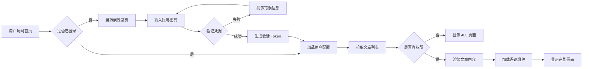

这是一篇测试文章，用来验证 Hugo 的多语言、Mermaid 和 LaTeX 是否正常工作。

## 1. Mermaid 测试

## 2. LaTeX 行内公式

在文字中嵌入公式，公式与文字同高。在文字中嵌入公式，公式与文字同高。在文字中嵌入公式，公式与文字同高。在文字中嵌入公式，公式与文字同高。在文字中嵌入公式，公式与文字同高。在文字中嵌入公式，公式与文字同高。在文字中嵌入公式，公式与文字同高。在文字中嵌入公式，公式与文字同高。在文字中嵌入公式，公式与文字同高。在文字中嵌入公式，公式与文字同高。在文字中嵌入公式，公式与文字同高。

质能方程 $E = mc^2$，欧拉恒等式 $e^{i\pi} + 1 = 0$，勾股定理 $a^2 + b^2 = c^2$。

二次方程求根公式 $x = \frac{-b \pm \sqrt{b^2 - 4ac}}{2a}$，求和公式 $\sum_{i=1}^{n} i = \frac{n(n+1)}{2}$。

当 $x \to \infty$ 时，函数 $f(x) = \frac{1}{x}$ 趋近于 $0$。

## 3. LaTeX 块级公式

块级公式独占一行并居中显示。

### 3.1 高斯积分

$$
\int_{-\infty}^{\infty} e^{-x^2} \, dx = \sqrt{\pi}
$$

### 3.2 麦克斯韦方程组

$$
\begin{aligned}
\nabla \cdot \mathbf{E} &= \frac{\rho}{\varepsilon_0} \\
\nabla \cdot \mathbf{B} &= 0 \\
\nabla \times \mathbf{E} &= -\frac{\partial \mathbf{B}}{\partial t} \\
\nabla \times \mathbf{B} &= \mu_0 \mathbf{J} + \mu_0 \varepsilon_0 \frac{\partial \mathbf{E}}{\partial t}
\end{aligned}
$$

### 3.3 矩阵

$$
\mathbf{A} = \begin{pmatrix}
a_{11} & a_{12} & a_{13} \\
a_{21} & a_{22} & a_{23} \\
a_{31} & a_{32} & a_{33}
\end{pmatrix}
$$

### 3.4 高斯分布

$$
\phi(x) = \frac{1}{\sqrt{2\pi\sigma^2}} \exp\left( -\frac{(x-\mu)^2}{2\sigma^2} \right)
$$

### 3.5 极限

$$
\lim_{n \to \infty} \left( 1 + \frac{1}{n} \right)^n = e
$$

### 3.6 傅里叶变换

$$
\hat{f}(\xi) = \int_{-\infty}^{\infty} f(x) \, e^{-2\pi i x \xi} \, dx
$$